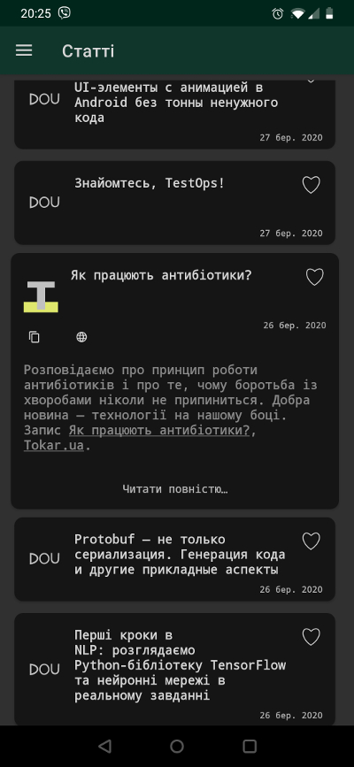

# Технаріум

*Читати [English](README.md)*

## Коротке знайомство

**Технаріум** - збірник новин (\*не тільки) із технічних ресурсів які мають від 50% українськомовного матеріалу.

\*Не тільки - у додаток до новин і статей присутні розділи пошуку роботи і технічних
подій в Україні (обидва запозичені з [DOU](https://dou.ua/?switch_lang=uk)).

Автор, або абстрактний я у вакуумі, декілька разів на день мусив перемикатись
між кількома ресурсами, щоб читати матеріал зручною мовою. Кожен ресурс окремо
не покривав усе необхідне, а далі як в тумані (с. Альф). 
Розповсюджується за ліцензією Apache 2, тому користуйтесь на здоров'я.

Декілька знімків екран із останньої версії:

На даний момент присутні наступні ресурси:
- [DOU](https://dou.ua/?switch_lang=uk)
- [Codeguida](https://codeguida.com/)
- [Pingvin Pro](https://pingvin.pro/)
- [Tokar](https://tokar.ua/)

\*\* Codeguida не надсилають (хоч обіцяли) дату публікації новини,
тому їх новини відображаються в кінці списку.

## Технології

Проєкт новий (початок 2020) і я намагався використовувати останні джедаївських
техніки і технології:

- [~~Світлові мечі~~](https://uk.wikipedia.org/wiki/%D0%A1%D0%B2%D1%96%D1%82%D0%BB%D0%BE%D0%B2%D0%B8%D0%B9_%D0%BC%D0%B5%D1%87).
- [Навігаційний компонент](https://developer.android.com/guide/navigation/navigation-getting-started).
- [Рум](https://developer.android.com/topic/libraries/architecture/room).
- [Екран запуску](https://material.io/design/communication/launch-screen.html#usage).
- [Дагер 2](https://developer.android.com/training/dependency-injection/dagger-android).
- [роболектрик](http://robolectric.org/getting-started/).
- [котлін](https://developer.android.com/kotlin) і його [корутини](https://kotlinlang.org/docs/reference/coroutines-overview.html).
- [MVVM](https://proandroiddev.com/mvvm-with-kotlin-android-architecture-components-dagger-2-retrofit-and-rxandroid-1a4ebb38c699) з LiveData і світськими розмовами.

## Архітектура

Розділ ще в написанні.

## Як зібрати проєкт?

Андроїд Студія:

1. Клонувати проєкт будь-яким зручним методом.
2. Імпортувати як gradle проєкт.
3. Запустити.

Командний рядок:

1. Імпортувати як зручно і перейти у теку з проєктом.
2. `./gradlew clean assembleDebug`
3. `find ./ -name "*.apk"`

## Корисні посилання

- [Гугл плей](https://play.google.com/store/apps/details?id=com.gmail.yaroslavlancelot.technarium).
- [Політика конфіденційності проєкту (англ)](https://github.com/YaroslavHavrylovych/technical_news/wiki/privacy_policy).
- [Ліцензія Apache версія 2 (англ)](LICENSE)

---------------------------------------
Ярослав Гаврилович
