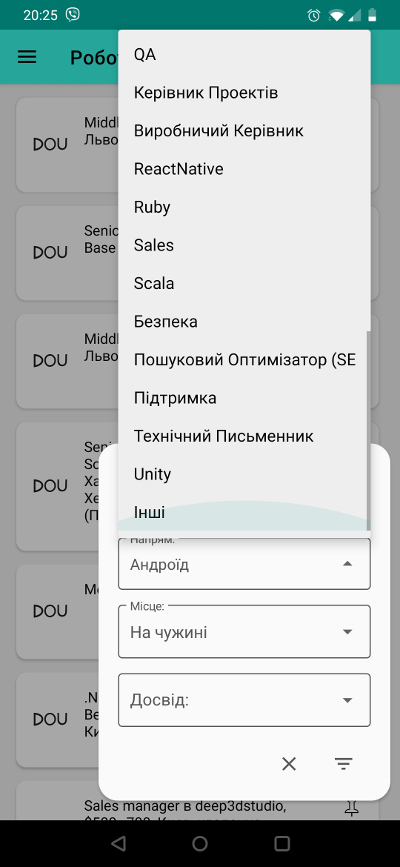

# Technarium

*Read in [Українська](README-UK.md)*

## A short introduction

**Technarium** - is technical news (\*not only) aggregator,
where at least 50% of the content is in Ukrainian.

\*Not only - two additional sections are openings and events (both from 
[DOU](https://dou.ua/?switch_lang=en))

The author, or an abstract me in a vacuum, was annoyed to switch a few
times per day within multiple web resources (to have it on needed language).
Each resource was not sufficient by itself.
Apache version 2 applied, so you can freely use the project.

A few screenshots from the latest version:

Next resources are available:
- [DOU](https://dou.ua/?switch_lang=en)
- [Codeguida](https://codeguida.com/)
- [Pingvin Pro](https://pingvin.pro/)
- [Tokar](https://tokar.ua/)

\*\* Codeguida doesn't have the publication date (even they promised),
that's why their news are always bottom.

## Technologies

The project's v2 is dated 2021, and I am trying to keep it fresh
with the latest Jedi techniques and technologies:

- [~~Lightsabers~~](https://en.wikipedia.org/wiki/Lightsaber).
- [Navigation component](https://developer.android.com/guide/navigation/navigation-getting-started).
- [Hilt](https://developer.android.com/training/dependency-injection/hilt-android).
- [kotlin](https://developer.android.com/kotlin) and his [coroutines](https://kotlinlang.org/docs/reference/coroutines-overview.html).

## Architecture

Still not finished.

## How to build the project?

Android studio:

1. Clone the project (any tool).
2. Import as a gradle project.
3. Run.

Command line:

1. Clone and navigate to the project's folder.
2. `./gradlew clean assembleDebug`
3. `find ./ -name "*.apk"`

## Useful links

- [GooglePlay](https://play.google.com/store/apps/details?id=com.gmail.yaroslavlancelot.technarium).
- [Privacy policy](https://github.com/YaroslavHavrylovych/technical_news/wiki/privacy_policy).
- [Apache version 2 license](LICENSE)

---------------------------------------
Yaroslav Havrylovych
